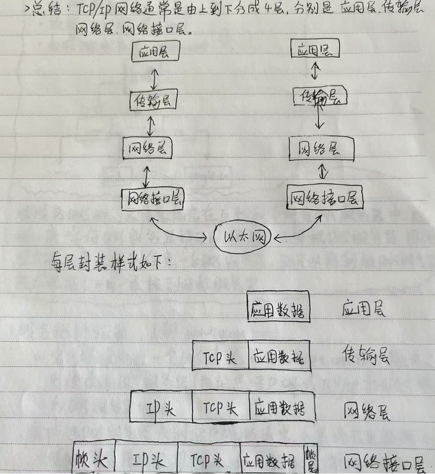

## OSI 参考模型

- 自上而下：

  - 应用层：提供不同应用之间的数据通信能力。（例如：HTTP, DNS）
  - 表示层：进行数据处理，对应用层传过来的数据进行**加密**、**解密**、**压缩**、**解压缩**等操作。
  - 会话层：主要负责建立、管理和终止会话，会话层通过在不同主机之间建立连接，实现不同主机之间的数据通信。
  - 传输层：进行数据传输。（例如：TCP, UDP）
  - 网络层：主要对子网之间的数据包进行路由选择。（例如：IP）
  - 数据链路层：确保数据在物理层传输的可靠性。
  - 物理层：负责物理介质之间的数据传输。（例如：光线、路由器）

## TCP/IP 网络模型

- 自上而下：

  - 应用层：应用层协议直接与应用程序进行交互，利用下层的数据传输能力实现各种功能，提供不同应用之间的数据传输能力。
  - 传输层：传输层为应用层提供网络支持，提供不同主机端到端的数据通信。这一层的关键协议是 **TCP 协议**。应用层传输的数据可能会非常大，当数据包超过 **MSS** ( TCP 最大报文段长度 ) 时，需要将数据包分块，这样即使传输途中有一个分块丢失或者损坏，只需要重新发送一个分块。在 TCP 种，每一个分块被称为 **TCP 段**。
  - 互联网层：互联网层的主要任务是实现不同网络之间的数据通信。这一层的关键协议是 **IP 协议** ，他为每个网络设备分配一个 IP 地址，通过 IP 地址来标识和定位主机。
  - 网络接口层：互联网层生成 IP 头之后需要交给网络接口层。将 IP 加上 Mac 头，封装成**数据帧**。

